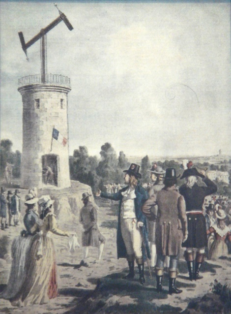

# Exercise: The Optical Telegraph

By Arnau Garcia Molsosa (agarcia@icac.cat). 

This exercise is designed as an introduction to Geographic Information Systems and, in a more general perspective, in how geospatial computational technologies can be applied to the research about Cultural Heritage. 

Through this exercise, we will use different types of geospatial digital data to represent and analyse an early Nineteenth Century communication network based in the intervisibility between different towers, known as the optical telegraph. For more information on the system, its history, and the specific materials of this tutorial, the following lectures are recommended:

> Dilhac, J. M. (2001). The telegraph of claude chappe-an optical telecommunication network for the xviiith century. Institut National des Sciences Appliquées de Toulouse. https://ethw.org/w/images/1/17/Dilhac.pdf

> Aguilar Pérez, Antonio and Gaspar Martínez Lorente. "La telegrafía óptica en Cataluña. Estado de la cuestión." Scripta Nova. Revista electrónica de geografía y ciencias sociales 7.133-156 (2003). http://www.ub.edu/geocrit/sn/sn-137.htm*

The exercise has been created in a way that can be completed without any previous knowledge of GIS. We will be using QGIS (the present document has been elaborated using the 3.12 version, note that some inconsistencies might arise due further updates. Contact your instructor if you encounter any problem).

To do the exercise download the [zip file](optical_telegraph_files.zip) and follow the instructions from the tutorial [document](exercici_telegraf_tutorial.pdf).

The exercise is an adaptation of a practical created for the sessions organised by the Computational and Digital Archaeology Laboratory ([CDAL](https://www.arch.cam.ac.uk/research/laboratories/cdal)) of the Department of Archaeology, Cambridge University, in the Peterhouse Archaeology Summer School (5-9/8/2019) and the Sutton Trust Summer School (22/8/2019). The materials were created by Enrico R. Crema, David .I. Redhouse, Arnau Garcia-Molsosa and Andreas Angourakis. This materials can be accessed on the following repository (https://github.com/Andros-Spica/CDAL-SummerSchool).
