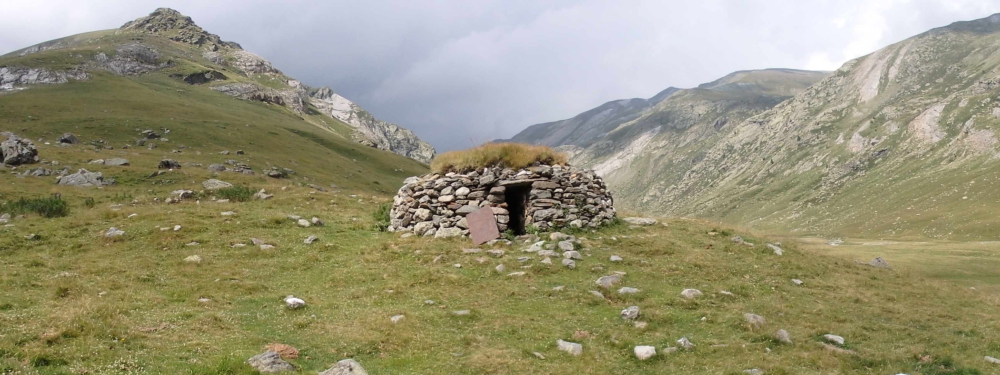

# Exercise: photointerpretation of pastoral structures in a Pyrenean valley
By Arnau Garcia Molsosa (agarcia@icac.cat). 

This exercise has been created as a basic introduction to the use of aerial imagery, including on-line services, to remotely detect archaeological features. 

The exercise is based on a research developed in upper valleys of the Pyrenean mountains (modern Catalonia). Situated at 2000-2500 masl, they are dominated by pastures shaped through a long-term interactions of the herding practices with the environment. For more information on the research project in the area:

> Palet, J. M.; Orengo, H. A.; Garcia-Molsosa, A.; Polonio, T.; Ejarque, A.; Miras, Y.; Riera, S. (2023). Landscape Archaeology in Eastern Pyrenees high mountain areas (Segre and Ter valleys, Northeast Iberian Peninsula): Human activities in the shaping of Mountain Cultural Landscapes. In Garcia-Molsosa, A. (Ed.), Archaeology of Mountain Landscapes. Interdisciplinary Research Strategies of Agro-Pastoralism in Upland Regions, IEMA Proceedings, State University of New York Press, Albany, NY, p. 179-196. <https://recercat.cat//handle/2072/537008>

> Colominas, L., Palet, J. M., & Garcia-Molsosa, A. (2020). What happened in the highlands? Characterising Pyrenean livestock practices during the transition from the Iron Age to the Roman period. Archaeological and Anthropological Sciences, 12(3), 69. https://doi.org/10.1007/s12520-020-01023-3

The exercise has been created in a way that can be completed without any previous knowledge of GIS. We will be using QGIS (the present document has been elaborated using the 3.12 version, note that some inconsistencies might arise due further updates. Contact your instructor if you encounter any difficulty).

To do the exercise download the [zip file](photointerpretation_pyrenees_files.zip) and follow the instructions from the tutorial [document](photointerpretation_pyrenees_tutorial.pdf). At the end of the exercise you can download the [zip file](photointerpretation_pyrenees_arqueorutes_files.zip) in order to check the results. 
